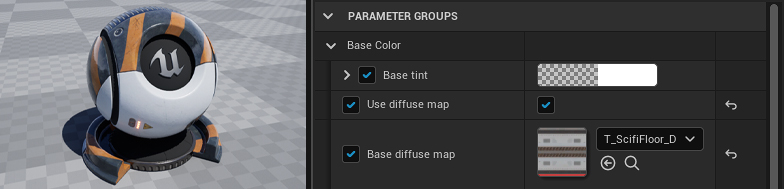

# ue5-master-material
A collection of Master Material Functions for Unreal Engine 5.

The full tutorial, with more examples, can be found here:
https://www.techarthub.com/the-anatomy-of-an-unreal-engine-master-material/

This project is licensed under the Unreal Engine 5 EULA.
